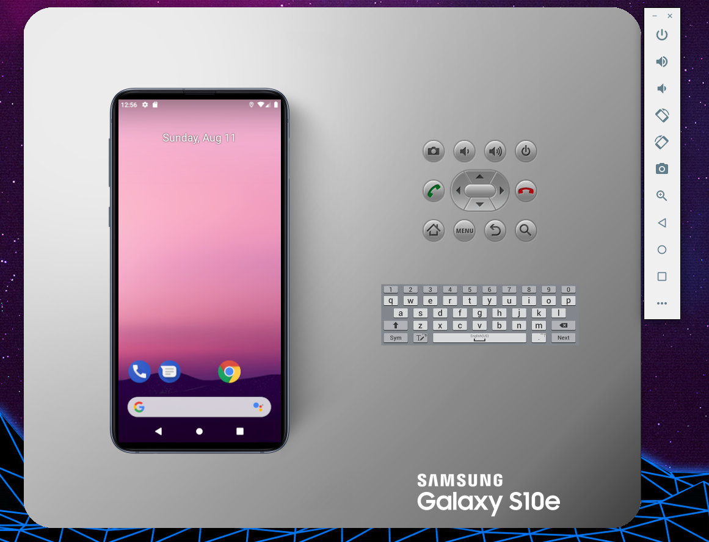

# SamsungDeviceSkins
AVD Samsung Device Skins for Android Studio

The official Samsung Hardware Device profiles are bulky and they take up an unnecessary real estate across my workspace. 

These device skins are much lighter and a more accurate representation of what the new Samsung Devices look like with curved screen corners.

### Requirements

Android-Studio

---

### Getting Started

#### 1) Clone & Copy the file

- 1.1) `git clone https://github.com/andy-h-dev/SamsungDeviceSkins.git`
- 1.2) `cd SamsungDeviceSkins` - cd into your newly created project directory.
- 1.3) Copy each of the device directories into your Android Skins directory -Adnroid/SDK/Skins

The official Samsung Device Profile (BEFORE)

Modified Samsung Device Profile (AFTER)
