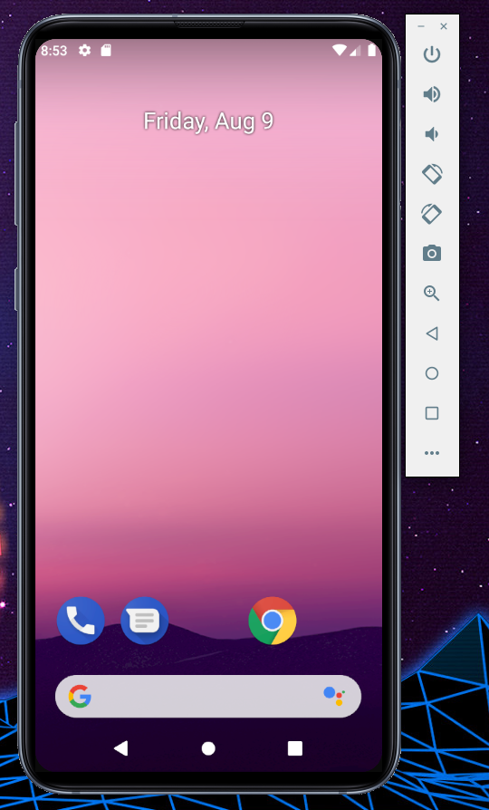

# SamsungDeviceSkins
AVD Samsung Device Skins for Android Studio

The official Samsung Hardware Device profiles are bulky and they take up an unnecessary portion of my workspace. 
These device skins won't take up a significant portion of your workspace.

### Requirements

Android-Studio

---

### Getting Started

#### 1) Clone & Copy the file

- 1.1) `git clone https://github.com/andy-h-dev/SamsungDeviceSkins.git`
- 1.2) `cd SamsungDeviceSkins` - cd into your newly created project directory.
- 1.3) Copy each of the device directories into your Android Skins directory -Adnroid/SDK/Skins

